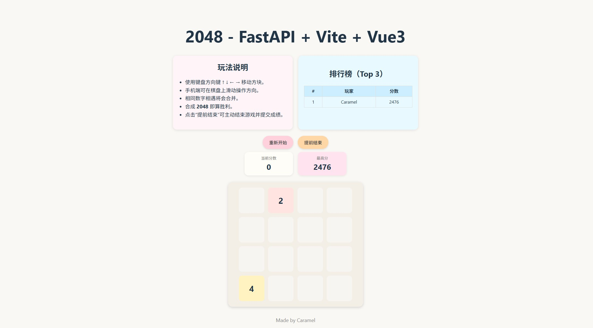
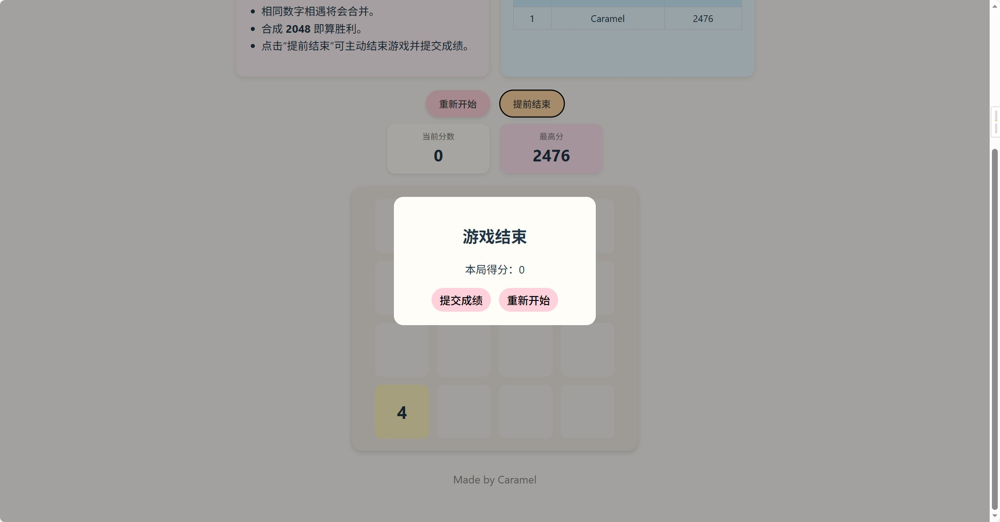
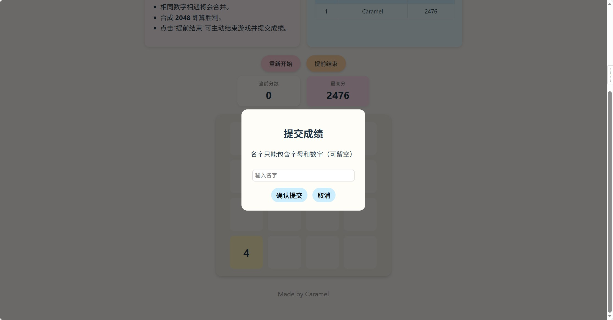

# 🎮 2048 - FastAPI + Vite + Vue3 (组件化高级版)

一个基于Python和Vue3拥有专业架构、完善动画、触屏支持、排行榜系统、自动启动脚本的 **高级 2048 游戏**。

本项目使用：

- **前端：Vue3 + Vite + 组件化架构**
- **后端：FastAPI + SQLite**
- **自动一键安装 / 一键启动脚本**
- **马卡龙色调 UI + 合并动画 + 移动动画**
- **支持触屏（手机可玩）**
- **支持胜利 / 失败弹窗，支持成绩提交**

---

# 🖼 项目截图

## 📌 主界面（棋盘 & 排行榜 & 说明书）


## 📌 游戏结束弹窗


## 📌 成绩提交界面


---

# 🚀 功能特点

### ✔ 组件化 Vue3 + Vite 前端  
- HelpCard  
- RankCard  
- ScoreBar  
- ControlButtons  
- GameBoard  
- ModalGameOver  
- ModalWin  
- ModalName  

### ✔ FastAPI 后端  
- 初始化棋盘  
- 移动逻辑  
- 分数计算  
- 胜利判断、失败判断  
- SQLite 排行榜  
- 同名玩家只记录最高分  

### ✔ 完整动画系统  
- 新方块动画  
- 合并动画  
- 平滑移动  

### ✔ 触屏支持  
- 上滑 / 下滑 / 左滑 / 右滑  
- 手机即可玩  

### ✔ 马卡龙色主题  
- 每个数字对应不同柔和色调  
- 可换皮肤  

### ✔ 一键启动脚本（生产环境）  
- 自动打开浏览器  
- 自动等待端口  
- 超稳定无卡顿  

### ✔ 一键安装依赖  
- 自动安装 pip + npm 依赖  
- 无需用户懂技术  

---

# 📦 项目结构

```
2048/
 ├─ backend/
 │   ├── app/
 │   │     └── main.py
 │   ├── database.db
 │   └── requirements.txt
 ├─ frontend/
 │   ├── src/
 │   ├── node_modules/
 │   └── package.json
 ├─ install_deps.py   ← 一键安装脚本
 ├─ run_prod.py       ← 一键运行脚本（生产模式）
 └─ README.md
```

---

# ⚙️ 安装依赖（第一次运行）

运行：

```
python install_deps.py
```

脚本自动完成：

- pip install -r requirements.txt  
- npm install  
- 自动创建 requirements.txt （如不存在）  
- 环境检测  

---

# 🚀 启动游戏（生产模式）

之后只需运行：

```
python run_prod.py
```

脚本会自动：

1. 启动后端（uvicorn，无 reload，超稳定）
2. 启动前端（Vite）
3. 自动等待端口启动
4. 自动打开浏览器 `http://127.0.0.1:5173`

---

# 🎮 游戏操作说明

## 💻 电脑端
| 操作 | 按键 |
|------|------|
| 上移 | ↑ |
| 下移 | ↓ |
| 左移 | ← |
| 右移 | → |

## 📱 手机 / 平板
- 上滑：向上移动  
- 下滑：向下移动  
- 左滑：向左移动  
- 右滑：向右移动  

---

# 📊 排行榜系统

排行榜存储在：

```
backend/database.db
```

规则：

- 名字只能包含：字母 + 数字  
- 同名玩家只保留最高分  
- 页面仅展示 **TOP3**  
- 游戏结束后可提交成绩  

---

# 📘 游戏说明（HelpCard）

- 通过方向键或滑动移动方块  
- 相同数字会合并（2+2=4）  
- 每次操作生成新方块（2 或 4）  
- 达到 **2048** 获得胜利（可继续）  
- 无法移动时游戏结束  

---

# 🔧 开发者指南（代码详细介绍）

## 🧩 useGameLogic.js（游戏大脑）
包含：

- 棋盘管理  
- 分数管理  
- API 调用  
- 动画标记（isNew / isMerged）  
- 弹窗控制  
- 移动逻辑封装  
- restart() / move() / submitScore() 等函数  

所有核心逻辑集中于此，是前端最重要的文件。

---

## 🟦 后端 main.py

包含：

- FastAPI 初始化  
- CORS 配置  
- SQLite 初始化  
- API：  
  - `/init`  
  - `/move/{direction}`  
  - `/leaderboard`  
  - `/submit_score`  
- 游戏逻辑函数：  
  - `move_board()`  
  - `new_tile()`  
  - `check_game_over()`  

---

## 🟩 前端组件结构

- **HelpCard**：游戏说明  
- **RankCard**：排行榜  
- **ScoreBar**：分数显示  
- **ControlButtons**：重新开始 / 提前结束  
- **GameBoard**：棋盘渲染  
- **ModalGameOver**：结束弹窗  
- **ModalWin**：胜利弹窗  
- **ModalName**：输入名字  

组件化结构清晰、易扩展、易维护。

---

## 🛠 启动脚本说明

### install_deps.py
- 自动安装 Python 依赖  
- 自动安装 Node 依赖  
- 新手友好  

### run_prod.py
- 不使用 reload，完全生产级  
- 自动等待端口  
- 自动打开浏览器  
- 适用于发布给普通玩家  

---

# ❤️ 作者

Made by **Caramel**

---

# 📜 License

MIT License
